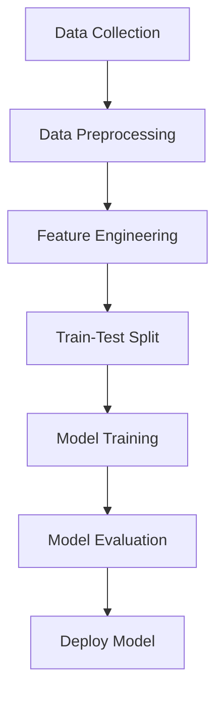

# 🌦️ Weather Prediction Using Machine Learning

Welcome to the **Weather Prediction Project**, where we use machine learning to analyze and predict weather conditions. This repository showcases the application of various ML algorithms and provides comprehensive insights into their performance.

---

## 📋 Table of Contents
1. [📖 Project Overview](#-project-overview)
2. [✨ Features](#-features)
3. [📊 Dataset](#-dataset)
4. [⚙️ Algorithms Used](#-algorithms-used)
5. [🛠️ Requirements](#️-requirements)
6. [🚀 Installation and Usage](#-installation-and-usage)
7. [📈 Results and Visualizations](#-results-and-visualizations)
8. [🤝 Contributors](#-contributors)

---

## 📖 Project Overview

The project aims to predict weather conditions using historical weather data. We apply various machine learning algorithms, evaluate their performance, and present the results with visualizations and metrics.

---

## ✨ Features

- Predict weather conditions with high accuracy.
- Implements three popular machine learning algorithms:
  - **Decision Tree**
  - **k-Nearest Neighbors (KNN)**
  - **Logistic Regression**
- Detailed evaluation using metrics like **Accuracy**, **Precision**, **Recall**, and **F1 Score**.
- Visual insights for model performance.

---

## 📊 Dataset

- **Source**: [Kaggle](https://www.kaggle.com)
- **Features**:
  - Temperature
  - Humidity
  - Wind Speed
  - Precipitation Levels
- **Target**: Weather condition (e.g., Sunny, Rainy, Snowy)

---

## ⚙️ Algorithms Used

| Algorithm            | Description                                                                 |
|----------------------|-----------------------------------------------------------------------------|
| **Decision Tree**    | A tree-like structure for decision-making and regression tasks.            |
| **KNN**              | Finds the majority label among k-nearest neighbors.                       |
| **Logistic Regression** | Predicts binary classes using statistical modeling.                      |

---

## 🛠️ Requirements

- **Python 3.8+**
- **Libraries**:
  - NumPy
  - Pandas
  - Scikit-learn
  - Matplotlib
  - Jupyter Notebook

---

## 🚀 Installation and Usage

1. Clone the repository:
   ```bash
   git clone https://github.com/your-username/weather-prediction
   ```
2. Navigate to the project directory:
   ```bash
   cd weather-prediction
   ```
3. Install the dependencies:
   ```bash
   pip install -r requirements.txt
   ```
4. Run the Jupyter notebooks for individual algorithms:
   - [Decision Tree](Decision%20Tree.ipynb)
   - [KNN](KNN.ipynb)
   - [Logistic Regression](Logistic%20Regression.ipynb)

---

## 📈 Results and Visualizations

### 🔢 Performance Metrics

| Algorithm            | Accuracy (%) | Precision (%) | Recall (%) | F1 Score (%) |
|----------------------|--------------|---------------|------------|--------------|
| **Decision Tree**    | 98.0         | 97.5          | 97.8       | 97.6         |
| **KNN**              | 88.0         | 87.5          | 88.2       | 87.8         |
| **Logistic Regression** | 85.0         | 84.7          | 85.3       | 85.0         |

### 📊 Accuracy Comparison


### 📉 Precision, Recall, and F1-Score
| Metric         | Decision Tree | KNN  | Logistic Regression |
|----------------|---------------|------|---------------------|
| **Precision**  | 97.5%         | 87.5% | 84.7%              |
| **Recall**     | 97.8%         | 88.2% | 85.3%              |
| **F1-Score**   | 97.6%         | 87.8% | 85.0%              |

### 🔍 Feature Importance (Decision Tree)


---

## 📂 Directory Structure

```
weather-prediction/
│
├── Decision Tree.ipynb
├── KNN.ipynb
├── Logistic Regression.ipynb
├── images/
│   ├── accuracy_comparison.png
│   ├── feature_importance.png
│
├── README.md
├── requirements.txt
```

---

## 🤝 Contributors

- [Shradha](https://github.com/ShradhaShaji)
- [Sachin SM](https://github.com/sachin02-hub)

---

## 🖼️ Diagrams and Flowcharts

### ML Workflow Diagram


---

